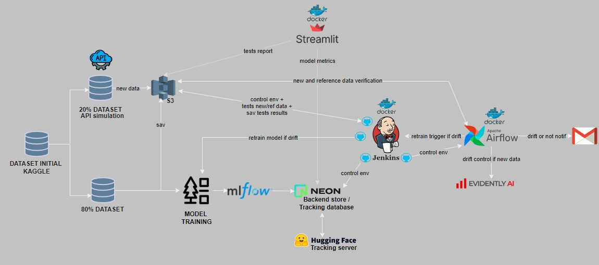

# 🌲 Forest Cover Type MLOps Pipeline


## 📋 Overview

Automated MLOps pipeline for Forest Cover Type prediction, featuring continuous integration, deployment, monitoring, and retraining capabilities.

The project is divided into several key parts, each managed by different team members:

Kevin: Responsible for data ingestion, model training, and versioning with MLflow.
Anne: In charge of monitoring and testing using Jenkins
Romain: Focused on production deployment, using Airflow and Evidently.ia for automated tasks and Streamlit dashboard.

- Project theme : https://www.kaggle.com/datasets/uciml/forest-cover-type-dataset

## 🏗️ Architecture



- **Data Storage**: AWS S3
- **Model Tracking**: MLflow (HuggingFace Server)
- **Database**: NeonDB
- **Orchestration**: Airflow
- **CI/CD**: Jenkins
- **Monitoring**: Evidently.ai
- **Dashboard**: Streamlit

## 🚀 Quick Start

### Prerequisites

- Docker and Docker Compose
- AWS Account
- NeonDB Account
- HuggingFace Account
- Evidently.ai Account

### Setup

1. **S3 Bucket Structure**

```bash
s3://S3bucket_name/covertype/
├── mlflow_artifact/
├── models/
│   └── model.pkl
├── new_data/
│   └── covtype_20.csv
│   └── covtype_sample_drift.csv
├── prediction/
├── reference/
│   └── covtype_80.csv
├── test_reports/
│   └── test_report_xxxxx.csv
```

2. **Environment Setup**
```bash
# Clone repository
git clone https://github.com/Rom1Legrand/IAI-B4-MLops_pipeline_CoverTypeForest.git
cd IAI-B4-MLops_pipeline_CoverTypeForest

# Create environment files :
# System Configuration
AIRFLOW_UID=50000
# Service URLs & Ports
AIRFLOW_API_URL=http://airflow-webserver:8080
MLFLOW_TRACKING_URI=http://mlflow:5000
JENKINS_URL=http://jenkins:8080
JENKINS_OPTS="--prefix=/jenkins"
JENKINS_HOME=/var/jenkins_home
# Email Server Configuration
SMTP_SERVER=smtp.gmail.com
SMTP_PORT=587
# S3 Configuration
S3_BUCKET=your_bucket_name
# Service Default Users (and cf docker-compose)
AIRFLOW_USERNAME=xxxx
MLFLOW_TRACKING_USERNAME=xxxx
JENKINS_ADMIN_ID=xxxx
# MLflow Configuration
MLFLOW_DEFAULT_ARTIFACT_ROOT=s3://your_bucket/your_project_name/
# NEON_DATABASE_URL (backend store for mlflow)
NEON_DATABASE_URL=your_posgres_neondb_url

# Create secrets files :
# AWS Credentials
AWS_ACCESS_KEY_ID=your_acces_key
AWS_SECRET_ACCESS_KEY=your_secret_key
# Email Credentials
EMAIL_USER=your_email
EMAIL_PASSWORD=your_email_password_or_token_key
# Service Passwords
AIRFLOW_PASSWORD=xxxx
MLFLOW_TRACKING_PASSWORD=xxxx
JENKINS_ADMIN_PASSWORD=xxxx

## Configure Credentials
### Jenkins Credentials
- AWS_ACCESS_KEY_ID
- NEON_DATABASE_URL
- AWS_SECRET_ACCESS_KEY
- AWS_DEFAULT_REGION
- S3_BUCKET

### Airflow Variables
- AWS credentials
- EVIDENTLY_CLOUD_PROJECT_ID
- EVIDENTLY_CLOUD_TOKEN
- JENKINS credentials
- Email settings

## Launch Services
```bash
docker-compose build
docker-compose up -d
```

## 🔄 Pipeline Flow

### Data Ingestion
- Monitor S3 for new data (covtype_20.csv ou covtype_sample_drift.csv for test)
- Trigger drift detection

### Drift Detection
- Evidently.ai analyzes data drift 
- Email notifications for drift status
- Trigger retraining if drift detected

### Model Training
- RandomForest model for training
- Jenkins executes training pipeline
- MLflow tracks metrics and parameters
- Model artifacts stored on S3

### Monitoring
- Streamlit dashboard displays metrics
- Test results visualization
- Performance tracking

## 🛠️ Components

### Jenkins Pipelines
- Environment setup
- Model testing
- Retraining triggers

### Airflow DAGs
- Data drift monitoring
- Email notifications
- Jenkins pipeline triggers

### Streamlit Dashboard
- Model metrics display
- Test results visualization
- Drift analysis

## 📊 Data

Dataset: [Forest Cover Type](https://archive.ics.uci.edu/static/public/31/covertype.zip)

- Training: 80% (covtype_80.csv)
- Testing: 20% (covtype_20.csv)

## 📝 Notes
- Jenkins uses Docker-out-of-Docker configuration
- MLflow server hosted on HuggingFace
- NeonDB stores MLflow metadata
- Pipeline triggers based on GitHub code updates

## 👥 Team
- **Kevin**: Data ingestion, model training, MLflow
- **Anne**: Monitoring, Jenkins testing
- **Romain**: Deployment, Airflow, Streamlit